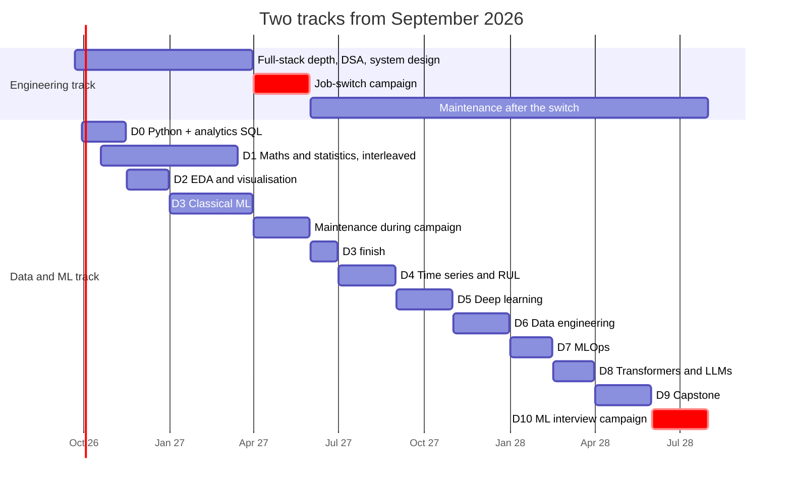

# DATA & ML ENGINEERING TRACK — zero to hero

**Status:** Planning. Adds a second long-term track to Atlas.
**Date:** 21 September 2026
**Relationship to the existing plan:** the Engineering track (near-term job switch) continues. This track is the long-term career direction. The earlier "AI product engineering" track folds into Phase D8 of this one.

This document is safe to commit: it contains no compensation, employer, client or confidential project detail.

---

## 1. What "hero" means

Not "finished a course." Not "knows 40 algorithms." A hero in this field can truthfully say:

- I can take a vague business problem and frame it as an ML problem — or explain why it shouldn't be one.
- I can get the data, clean it, and prove it's clean.
- I can build a model that beats an honest baseline, under a validation scheme I can defend line by line.
- I can explain why it works, where it fails, and what it costs to run.
- I can ship it behind an API, monitor it for drift, retrain it, and roll it back on purpose.
- I can build the pipeline that feeds it, and rerun that pipeline for any past date and get the same answer.
- I can explain all of it to an engineer, a product manager, and a CEO.
- **I can do the core of it without an AI assistant.** That last line is not optional in this field — see §4.1.

Everything in this document is instrumentation for those eight sentences.

---

## 2. The target: ML Engineer, with data engineering as the bridge

"Data Science Engineer" is not one job. In 2026 the market uses four titles, inconsistently:

| Title | Centre of the work | Signature skills | Fit for you |
|---|---|---|---|
| Data Scientist | Analysis, statistics, experiments, business insight | Python, SQL, statistics, communication | Possible. Weights statistics and business framing over engineering |
| **ML Engineer** | Building, shipping and running ML systems | Production Python, ML, MLOps, cloud, system design | **Strongest fit.** Rewards the engineering you already have |
| Data Engineer | Pipelines, warehouses, data platforms | SQL, pipelines, orchestration, cloud | **Best bridge.** Reuses your backend skills most directly |
| AI Engineer | Applications on top of LLMs | LLM APIs, retrieval, evals, system design | Already partly in your plan; folds into D8 |

**Recommendation: target ML Engineer, and treat Data Engineering as both the bridge and the fallback.**

Three reasons, all specific to you:

1. **The ML Engineer coding round is now close to a software engineering round.** Strong software engineers often pass that screen and then struggle on ML system design and ML coding. You will be on the right side of that split — your DSA and system design prep from the Engineering track carries straight over.
2. **ML system design and MLOps reward production experience.** Drift, rollback, latency budgets, debugging at 3 a.m. — you have run production systems. Most people coming from notebooks have not.
3. **SQL is the first filter for every data role**, and it is also your largest current engineering gap. Every hour spent on PostgreSQL in the Engineering track counts twice.

Data Engineering is worth naming separately: the talent pool is smaller relative to demand, compensation is competitive at mid and senior levels, and it is reachable roughly 6–8 months sooner than ML Engineering because it reuses what you already know. If you ever want the fastest landing in the data world, it's there.

Market sources for these claims are in the appendix.

---

## 3. How this fits the existing plan

### 3.1 Two tracks, one Today screen

| Track | Purpose | Horizon |
|---|---|---|
| **Engineering** | The near-term job switch to a stronger full-stack/product role | Months 1–8 |
| **Data & ML** | The long-term career move to ML Engineering | Months 1–22 |

The scheduler still produces one short daily plan. A vast curriculum does not mean a vast Today screen — 358 skill nodes sit behind SKILLS and PROJECTS, and TODAY shows three to five missions, each tagged with its track. That is the answer to "won't this turn into a dictionary?" The dictionary exists; you never have to read it.

### 3.2 Time split

**Phase 1 — until the job switch (≈ months 1–8), NORMAL ≈ 11 h/week**

| Thread | Share | ≈ h/week |
|---|---|---|
| Engineering dominant theme | 30% | 3.3 |
| **Data & ML** | **30%** | **3.3** |
| DSA | 15% | 1.6 |
| System design | 10% | 1.1 |
| Communication | 7% | 0.8 |
| Spaced review (both tracks) | 8% | 0.9 |

During the job-switch campaign (≈ months 7–8), Data & ML thins to 1.5 h/week of maintenance and review. Do not let a new track compete with offers.

**Phase 2 — after the switch:** flip. Data & ML becomes the dominant theme at 55–65%; engineering drops to maintenance (DSA and system design stay alive, because the ML Engineer loop tests both).

### 3.3 Honest timeline

At ≈ 3.3 h/week before the switch and ≈ 6.5 h/week after it, ML Engineer interview-readiness lands around **month 20–22** (mid-2028). At 10 h/week after the switch, it compresses to roughly **month 17–18**. Data Engineer readiness comes 6–8 months earlier.

There is no honest version of this that takes six months from zero. Anyone selling that is selling a certificate, and certificates are the thing this plan is designed to avoid.

### 3.4 What changes in the earlier plan

| Earlier decision | Now |
|---|---|
| "LLM fine-tuning: deliberately not a priority" | Moves into D8. It now compounds with the career direction |
| AI product track (B) as a separate differentiator | Folds into D8. The Atlas eval harness is D8's first project |
| PostgreSQL as a major priority | **Raised.** SQL is the first filter for every data role |
| Kafka: concepts only | Unchanged — concepts plus one small streaming project in D6 |
| DSA ≈ 130–160 problems | Unchanged near-term; the ML Engineer loop keeps it relevant long-term |

---

## 4. How you'll learn it

### 4.1 The silent-failure rule

In web development, wrong code usually crashes. In data science, wrong code produces a confident number.

A model trained with the test set leaking into it gets a beautiful score and is useless. A random split on time-series data "predicts" the future by peeking at it. The wrong metric on imbalanced data reports 99.8% accuracy for a model that catches zero fraud. None of these throw an error. AI assistants produce all three fluently, because the code is syntactically perfect.

This is why vibe coding is more dangerous here than anywhere else in your career. It is not a moral point — it's that the failure is invisible until someone asks you "how do you know this result is valid?" in an interview, or until a model fails in production.

### 4.2 Eight rules for this track

1. **Build it by hand once.** Every core algorithm — linear and logistic regression, k-means, a decision-tree split, backprop, AUC — gets implemented in NumPy before you use the library. Not for production. For understanding. **AI off** for the first implementation.
2. **Predict before you run.** Before executing a cell, write down the expected shape, value or metric. A surprise is the learning signal. No prediction, no surprise, no learning.
3. **Simulate before you trust a formula.** Learn the CLT by simulating it. Learn confidence intervals by bootstrapping them. Learn p-values by running a permutation test. Then learn the formula — it will make sense.
4. **Watch, close, explain.** A video only counts if you close it and explain what you learned without rewinding. The WATCH mission enforces this.
5. **Always beat a dumb baseline first.** Mean predictor, majority class, yesterday's value. If your model doesn't beat it, you don't have a model.
6. **Every project answers "how do I know this is valid?"** A required section: split strategy, leakage audit, baseline comparison, error analysis.
7. **Explain it to three audiences.** Engineer, product manager, CEO. If you can't do the CEO version, you don't understand the "why."
8. **AI is allowed after understanding.** Once you can explain it, use AI to go faster — exactly as you do at work. The order matters, not the tool.

### 4.3 Making it not boring

**Format rotation.** The same concept arrives through different activities — watch a visual explanation, compute it by hand, run it in a notebook, draw a chart, explain it aloud, defend it in a mock interview, apply it to a real dataset. Four new mission formats support this track:

| Format | What you do | Evidence it produces |
|---|---|---|
| `WATCH` | Watch a curated video, then explain it with the video hidden | Explanation attempt |
| `NOTEBOOK` | Work in Colab or Kaggle; submit the link, your metric, the baseline, and a validity note | Artifact + sourced metric |
| `MATH_BY_HAND` | Compute or derive on paper; enter the numeric answer | Objective pass/fail |
| `VISUALIZE` | Make a chart; say what it shows and what a worse chart would hide | Artifact |

**Data you actually care about.** Early projects use IPL cricket data, Indian air-quality data, and — once Atlas has six weeks of your real usage — **your own learning data.** Nobody else in the world has that dataset.

**Boss challenges.** Kaggle's recurring playground competitions are public leaderboards with real stakes and no consequences. One per phase from D3 onward.

**Visual first, always.** This field has the best free visual learning material of any technical subject. §8 lists it. Use it before any textbook.

**Build in public.** One short write-up per phase. It doubles as communication practice and as portfolio evidence.

### 4.4 A sample week (Data & ML thread, Phase 1, ≈ 3.3 h)

The Today engine decides the actual days. This is the shape it aims for:

| Day | Minutes | Mission |
|---|---|---|
| Mon | 20 | `WATCH` a 3Blue1Brown or StatQuest video → explain it |
| Tue | 30 | `NOTEBOOK` — a pandas or SQL exercise |
| Thu | 25 | `MATH_BY_HAND` — derive or compute, then verify in NumPy |
| Sat | 90 | Project block |
| Sun | 20 | Spaced review across both tracks |

---

## 5. The curriculum — eleven phases

Hours are estimates for a focused learner with an engineering background, including project time.

### D0 — Python for data and analytics SQL · ≈ 20–25 h · weeks 1–7

**Goal:** the tools stop being the obstacle.

**Topics.** Python fluency for data work (you know JavaScript, so syntax comes fast — the real learning is the idioms: comprehensions, dicts, functions, virtual environments). NumPy: arrays, vectorisation, broadcasting, axes — the mental shift away from loops. pandas: Series and DataFrames, selection, groupby-aggregate, merge, pivot and melt, datetimes. Notebook discipline: "restart and run all" before you trust any result. SQL from the ground up: SELECT, WHERE, GROUP BY, HAVING, inner and left joins (including the `ON` versus `WHERE` trap from your own repository), subqueries, CTEs, window functions, and cohort and funnel queries. DuckDB and polars as awareness.

**Learn it.**
- **Play first:** SQLBolt — interactive, visual, short lessons. Start here. Then Select Star SQL for story-driven practice.
- **Practise:** Kaggle Learn — Python, Pandas, Intro to SQL, Advanced SQL. Free, in the browser, 3–5 hours each.
- **Watch:** Corey Schafer's pandas series on YouTube.
- **Reference:** *Python for Data Analysis* (Wes McKinney, free online). Chapters 4–10 as reference, not cover to cover.
- **Drill:** DataLemur easy SQL questions.

**Projects:** P1, P2.

**Done when:** from a raw CSV, you answer five questions in pandas while looking up syntax no more than twice — and you write a 7-day retention cohort query in SQL from a blank editor.

### D1 — Mathematics and statistics, visual first · ≈ 25–30 h · interleaved weeks 4–25

**Goal:** the maths stops being magic; you can simulate and explain statistics.

**Approach.** Never a boring block. About an hour a week, interleaved with everything else, in the order: watch the visual version → compute by hand → simulate in NumPy.

**Topics.**
- *Linear algebra:* vectors and the dot product (it's similarity — you'll meet it again in embeddings), matrix multiplication as a transformation, eigenvector intuition, SVD and PCA intuition.
- *Calculus:* the derivative as a rate of change, the chain rule (this *is* backpropagation), partial derivatives and gradients, gradient descent.
- *Probability:* counting and rules, conditional probability and Bayes (the medical-test paradox), random variables, the distributions that actually show up (Bernoulli, binomial, Poisson, normal, exponential), expectation and variance.
- *Statistics:* descriptive statistics, sampling and the CLT (simulate it), confidence intervals, hypothesis tests, p-values and error types, bootstrap and permutation tests, inference in regression.

**Learn it.**
- **Watch:** 3Blue1Brown — *Essence of Linear Algebra* (the single best visual maths series ever made), *Essence of Calculus*, and the Bayes theorem video. StatQuest's statistics fundamentals playlist.
- **Play:** Seeing Theory — interactive probability and statistics from Brown University.
- **Practise:** Khan Academy Statistics & Probability; `MATH_BY_HAND` missions in Atlas.
- **Read:** *Practical Statistics for Data Scientists* (Bruce, Bruce & Gedeck). *Mathematics for Machine Learning* (free PDF) as a reference only.

**Project:** P3.

**Done when:** you explain a p-value correctly to a product manager — including what it is *not* — compute a 95% confidence interval both by formula and by bootstrap and get close answers, and derive the gradient of mean squared error on paper.

### D2 — Exploratory analysis, visualisation, storytelling · ≈ 12–15 h

**Goal:** you can find what's in data and show it honestly.

**Topics.** An EDA routine (shape, types, distributions, missingness, outliers, relationships), choosing the right chart, matplotlib and seaborn, plotly, how charts mislead (truncated and dual axes), Streamlit dashboards, and writing the one-paragraph "so what."

**Learn it.**
- **Read (free):** *Fundamentals of Data Visualization* (Claus Wilke).
- **Read:** *Storytelling with Data* (Cole Nussbaumer Knaflic) — short and practical.
- **Play:** Setosa's *Explained Visually* interactive explainers.
- **Practise:** Kaggle Learn Data Visualization.

**Project:** P5.

**Done when:** shown a chart, you can say what's misleading about it; given a dataset, you produce five honest charts and one paragraph a non-engineer understands.

### D3 — Classical machine learning · ≈ 45–55 h

**Goal:** you build a valid model *and prove it's valid.*

**Topics.**
- *Foundations:* is this even an ML problem? Train, validation and test; baselines; bias and variance; L1 and L2 regularisation; cross-validation; **data leakage — the silent killer.**
- *Algorithms:* linear and logistic regression (from scratch first), k-nearest neighbours, decision trees, random forests, gradient boosting (XGBoost and LightGBM — the tabular workhorses), intuition for SVMs and naive Bayes.
- *Unsupervised:* k-means, hierarchical clustering, DBSCAN, PCA, anomaly detection.
- *Evaluation:* MAE and RMSE, precision, recall and F1, ROC-AUC versus PR-AUC, calibration, class imbalance, error analysis.
- *Features:* encoding, scaling, selection, and scikit-learn pipelines (which exist largely to prevent leakage).

**Learn it.**
- **Watch:** StatQuest's machine learning playlist — every algorithm, visually.
- **Play:** MLU-Explain (Amazon's interactive explainers for bias-variance, ROC/AUC, decision trees, cross-validation, precision-recall). R2D3's *Visual Introduction to Machine Learning*, parts 1–2.
- **Course:** Andrew Ng's *Machine Learning Specialization* (DeepLearning.AI). The classic foundation. You don't need the certificate.
- **Read:** *An Introduction to Statistical Learning with Applications in Python* (ISLP — free PDF with Python labs), chapters 2–6, 8, 12. *Hands-On Machine Learning* (Aurélien Géron), part I — the best practical book in the field.
- **Practise:** Kaggle Learn Intro to ML, Intermediate ML, Feature Engineering. The scikit-learn user guide.
- **Boss challenge:** a Kaggle playground competition.

**Projects:** P4, P6, P7, P8.

**Done when:** you implement logistic regression with gradient descent in NumPy from memory, explain bias-variance with a drawing, spot leakage in someone else's notebook, and justify PR-AUC over accuracy for fraud detection.

### D4 — Time series, forecasting, anomaly detection · ≈ 30 h

**The bridge to your industrial telemetry experience** — done entirely on public data, so none of it is confidential.

**Goal:** forecasting and remaining-useful-life prediction, with validation you can defend.

**Topics.** Trend, seasonality and autocorrelation; stationarity; decomposition; ARIMA and exponential-smoothing baselines; machine-learning forecasting with lag and window features; **walk-forward validation** (a random split leaks the future — the classic mistake); remaining useful life as regression and as survival; anomaly detection on sensor data (statistical thresholds, isolation forests, and later autoencoders).

**Learn it.**
- **Read (free):** *Forecasting: Principles and Practice*, 3rd edition (Hyndman & Athanasopoulos). Examples are in R — read it for concepts and implement in Python with statsmodels.
- **Practise:** Kaggle Learn Time Series.
- **Dataset:** NASA's Turbofan Engine Degradation Simulation (C-MAPSS) — the canonical remaining-useful-life dataset, available from NASA's Prognostics Data Repository and mirrored on Kaggle.

**Project:** P9.

**Done when:** you can explain why random K-fold is wrong for time series and *show the leak numerically,* and your RUL model beats a naive baseline under walk-forward validation.

### D5 — Deep learning, from scratch then PyTorch · ≈ 45 h

**Goal:** backpropagation you could derive; a training loop you could debug.

**Topics.** Neurons, activations and losses; backpropagation as the chain rule; building micrograd; PyTorch tensors and autograd; the training loop; SGD and Adam; overfitting in deep learning (dropout, weight decay, early stopping); CNNs; sequence models; transfer learning.

**Learn it.**
- **Watch and build:** Andrej Karpathy's *Neural Networks: Zero to Hero.* Literally named for what you asked for. Build micrograd, makemore and a GPT alongside him — pause, type, predict, then play.
- **Watch:** 3Blue1Brown's neural networks series — backpropagation, visually.
- **Play:** TensorFlow Playground — train a network in your browser and watch decision boundaries form.
- **Course:** fast.ai *Practical Deep Learning for Coders* (top-down, free).
- **Read:** *Dive into Deep Learning* (free, runnable). The official PyTorch tutorials.

**Projects:** P10, P11.

**Done when:** you write micrograd's backward pass from memory, and you can diagnose a loss curve — not learning, overfitting, exploding — by looking at it.

### D6 — Data engineering · ≈ 40 h

**Your backend skills transfer here most directly.**

**Goal:** pipelines that are idempotent, tested and rerunnable.

**Topics.** Batch versus streaming; ETL versus ELT; idempotent pipelines (your webhook idempotency, applied to data); data contracts; dimensional modelling and star schemas; dbt (models, tests, documentation); columnar formats and Parquet; lakehouse table formats (concepts); orchestration with DAGs (Airflow, Dagster or Prefect); scheduling and backfills; Spark fundamentals; Kafka concepts; change data capture.

**Learn it.**
- **Course (free, project-based):** DataTalksClub *Data Engineering Zoomcamp.*
- **Read:** *Fundamentals of Data Engineering* (Reis & Housley). *The Data Warehouse Toolkit* (Kimball), chapters 1–3, for dimensional modelling.
- **Docs:** dbt; DuckDB (a warehouse on your laptop).

**Project:** P12.

**Done when:** rerunning your pipeline for any past date produces identical results, and your dbt tests catch a deliberately corrupted input.

### D7 — MLOps and model serving · ≈ 30 h

**Goal:** a model you can ship, watch, retrain, and roll back.

**Topics.** Experiment tracking (MLflow); model registries; reproducibility (pinned environments, seeds, data versions); batch versus online inference; serving with FastAPI; containerisation; latency and cost trade-offs; data drift versus concept drift; performance monitoring; retraining triggers; feature stores (concepts); CI/CD for ML.

**Learn it.**
- **Read (free):** *Made With ML* (Goku Mohandas) — production ML end to end.
- **Course (free):** DataTalksClub *MLOps Zoomcamp*, and the deployment modules of the *ML Zoomcamp.*
- **Read:** *Designing Machine Learning Systems* (Chip Huyen). The book for this phase and for ML system design interviews.
- **Tools:** MLflow; Evidently for drift reports.

**Project:** P13.

**Done when:** you simulate drift, watch your monitor flag it, retrain, promote the new model through the registry — and roll it back, on purpose.

### D8 — Transformers, LLMs, fine-tuning, retrieval, evals · ≈ 30 h

**The earlier AI product track folds in here.**

**Goal:** you understand the model beneath the API, and you can measure an LLM feature.

**Topics.** Embeddings; attention and transformers; pretraining versus fine-tuning; parameter-efficient fine-tuning (LoRA — the concept plus one small run); the Hugging Face ecosystem; retrieval-augmented generation (chunking, retrieval, reranking, grounding); evaluation (golden sets, rubric design, judge bias); GenAI system design; cost and latency.

**Learn it.**
- **Visual:** *The Illustrated Transformer* (Jay Alammar); 3Blue1Brown's transformer and attention videos.
- **Build:** Karpathy's "Let's build GPT"; *Build a Large Language Model (From Scratch)* (Sebastian Raschka).
- **Course (free):** Hugging Face Learn.
- **Read:** *AI Engineering* (Chip Huyen).

**Project:** P14 — the Atlas eval harness counts.

**Done when:** you explain attention with a drawing, and you have an eval that caught a real regression.

### D9 — Capstone · ≈ 50 h

P15, below. The single project that tells the whole story.

### D10 — ML interview preparation · ≈ 50 h · 8 weeks

§7.

---

## 6. The project ladder — fifteen projects, small to big

Every project lives in a public GitHub repository or public notebook, has a README with a **"How do I know this is valid?"** section, and is logged as evidence in Atlas with its artifact URL. A project with no public artifact does not count — that rule is enforced by the evidence ledger's `verified_requires_artifact` constraint.

| # | Project | Level | Phase | Data | Proves | ≈ h |
|---|---|---|---|---|---|---|
| P1 | IPL match analytics | Beginner | D0 | IPL ball-by-ball data (Kaggle) | pandas fluency; asking good questions | 6–8 |
| P2 | SQL analytics case | Beginner | D0 | Olist Brazilian e-commerce (Kaggle) in DuckDB or your dev Neon branch | Analytics SQL — the first filter for every data role | 6–8 |
| P3 | Simulate the CLT, run an A/B test | Beginner+ | D1 | Simulated, then a public A/B dataset | You understand p-values instead of reciting them | 6 |
| P4 | Regression from scratch | Intermediate | D3 | Synthetic + one small real dataset | You know what `.fit()` actually does | 8 |
| P5 | India air-quality dashboard | Intermediate | D2 | India air-quality data (Kaggle / data.gov.in) | EDA, time handling, honest charts, shipping | 8–10 |
| P6 | House prices, done honestly | Intermediate | D3 | Kaggle *House Prices* competition | The full classical ML workflow | 12–15 |
| P7 | Fraud under imbalance | Intermediate | D3 | *Credit Card Fraud Detection* (Kaggle, ULB) | Metric choice when stakes are real | 8–10 |
| P8 | **Learn from your own learning** | Intermediate | D3 | Your Atlas attempt data (after ~6 weeks) | A dataset nobody else has | 6–8 |
| P9 | Engine remaining-useful-life | Intermediate+ | D4 | NASA C-MAPSS | Time-series rigour; mirrors industrial work on public data | 15–20 |
| P10 | micrograd → makemore | Advanced | D5 | Karpathy's series | Backprop you can derive | 12–15 |
| P11 | Transfer-learning classifier, shipped | Advanced | D5 | Your choice of image dataset | The DL training loop, plus shipping | 10–12 |
| P12 | Batch data pipeline | Advanced | D6 | A public open-data source | Data engineering competence | 20 |
| P13 | Productionise the RUL model | Advanced | D7 | P9's model | MLOps | 15–20 |
| P14 | LLM feature with evals | Advanced | D8 | Atlas eval harness, generalised | Eval literacy | 10–15 |
| P15 | **CAPSTONE: predictive maintenance platform** | Hero | D9 | C-MAPSS replayed as a live stream | The whole stack, end to end | 40–60 |

### Project briefs

**P1 — IPL match analytics.** Load ball-by-ball data, clean it, and answer five questions you genuinely care about — does winning the toss matter at certain venues? which batters accelerate best in death overs? Ten charts, one README of findings. The point is fluency, and the fastest route to fluency is curiosity.

**P2 — SQL analytics case.** Load the Olist dataset into DuckDB or your dev Neon branch. Answer fifteen business questions in SQL only — including monthly revenue, a 7-day retention cohort, a checkout funnel, and top sellers by repeat purchase using window functions. Every query in a `.sql` file with the question as a comment.

**P3 — Simulate the CLT and run an A/B test.** First simulate: draw from skewed distributions and watch sample means become normal. Then bootstrap a confidence interval. Then run a permutation test. Only then use the textbook formulas — and compare them to your simulations. Finish with a power calculation: how many users would this test have needed?

**P4 — Regression from scratch.** Linear regression by gradient descent in NumPy, with a loss curve. Then logistic regression. Match scikit-learn's coefficients to four decimal places. **AI off.** This one project removes more mystery from machine learning than any course.

**P5 — India air-quality dashboard.** Explore multi-city pollution data: seasonality, the Diwali spike, city comparisons, missing-sensor patterns. Ship a Streamlit dashboard publicly. Include one deliberately misleading chart next to your honest version, with an explanation.

**P6 — House prices, done honestly.** The Kaggle competition, but graded on rigour rather than rank: a baseline, a leakage audit, cross-validation, feature engineering, gradient boosting, and error analysis on the worst predictions. Submit to the leaderboard — that's the boss fight.

**P7 — Fraud under imbalance.** 0.17% positives. Show that accuracy is meaningless, use PR curves, calibrate probabilities, and choose a decision threshold from a cost you state explicitly (a missed fraud costs X, a false alarm costs Y).

**P8 — Learn from your own learning.** Once Atlas has six weeks of your real attempts: does your self-rated confidence predict your next success? Which mission formats produce the best retention? Is there a time-of-day effect? The result can tune your own scheduler's weights — a real ML problem with a real user. Keep the repository private or publish only aggregated findings; this is your personal data.

**P9 — Engine remaining-useful-life.** On C-MAPSS: exploratory analysis of sensor degradation, feature engineering with rolling windows, walk-forward validation, a naive baseline, gradient boosting, and anomaly flags. Show the leak numerically by also running a random split. This is the seed of the capstone.

**P10 — micrograd → makemore.** Follow Karpathy, typing everything yourself. Then extend it: add an operation he didn't, and train a small MLP on a toy dataset with your own engine. Then rebuild it from memory a week later.

**P11 — Transfer-learning classifier, shipped.** Fine-tune a pretrained vision model on a dataset you choose. Error analysis on the confusion matrix — what does it confuse, and why? Deploy it as a public demo (a Hugging Face Space or Streamlit).

**P12 — Batch data pipeline.** Ingest → Parquet → warehouse (DuckDB or Postgres) → dbt models with tests → an orchestrated DAG → a small dashboard. Must be idempotent and backfill-safe. Write down the three ways it could fail and show that it handles each.

**P13 — Productionise the RUL model.** P9's model behind FastAPI, containerised, tracked in MLflow, promoted through a registry, monitored for drift with Evidently, with scheduled retraining. Then simulate drift and roll back.

**P14 — LLM feature with evals.** Generalise the Atlas eval harness: a golden set, decomposed rubrics, judge-agreement measurement. Publish the eval results, including one regression it caught.

**P15 — CAPSTONE: predictive maintenance platform.** Replay C-MAPSS as a live sensor stream (Redis Streams — which you already know), compute online features, serve RUL predictions, raise anomaly alerts, show everything on a React dashboard (your strongest skill), and run drift monitoring with a retraining pipeline. Ship a model card, an architecture write-up, honest metrics, a blog post and a five-minute demo video.

This is the answer to "walk me through a system you built, end to end." It mirrors the kind of industrial telemetry work you've done professionally, on fully public data — so it is entirely yours to show, discuss and publish.

---

## 7. Interview preparation — the final phase

### 7.1 The 2026 ML Engineer loop

| Round | What it tests | How you prepare |
|---|---|---|
| Coding | Software-engineering-level algorithms — the bar for ML roles has risen toward SWE | Your Engineering-track DSA, kept alive |
| ML coding | Implement from scratch: k-means, logistic regression, metrics, a training loop | Rule 1 pays off here. Rewrite P4 and P10 from memory, timed, AI off |
| SQL | A vague business question turned into a correct query, out loud | DataLemur, StrataScratch |
| ML fundamentals | Bias-variance, regularisation, metrics, leakage, trees versus linear models | Explain-aloud missions |
| Statistics & probability | Confidence intervals, tests, Bayes, A/B design (heavier for DS-leaning roles) | `MATH_BY_HAND`, experimentation drills |
| ML system design | A vague product problem → a working ML system with data, metrics, serving, monitoring. Increasingly includes GenAI and retrieval | A consistent 6-step framework, eight mock designs |
| MLOps / production | Drift, rollback, debugging under failure | P13 and capstone incidents, told as stories |
| Project deep dive | One end-to-end project: goal, data, labels, features, model, launch, monitoring, failure modes, what you changed | The capstone, interrogated repeatedly in Atlas |
| Behavioural | Ownership, disagreement, incidents | The story bank you already build |

### 7.2 Eight weeks

| Weeks | Focus |
|---|---|
| 1–2 | SQL and statistics drills daily; ML fundamentals explain-aloud |
| 3–4 | ML coding from scratch, timed and AI-off; the system design framework plus three mocks |
| 5–6 | Five more system design mocks, two of them GenAI; capstone deep dive three times |
| 7–8 | Full mock loops; applications and referrals; real interviews |

### 7.3 Resources

- *Introduction to Machine Learning Interviews* (Chip Huyen, free online)
- *Ace the Data Science Interview* (Nick Singh & Kevin Huo)
- *Machine Learning System Design Interview* (Ali Aminian & Alex Xu)
- DataLemur and StrataScratch for SQL, statistics and ML questions
- *Designing Machine Learning Systems* (Chip Huyen), reread

### 7.4 Your advantages, stated plainly

You'll pass the software-engineering coding screen that trips candidates coming purely from notebooks. You've run production systems, which is what the MLOps block probes. And your capstone mirrors real industrial work. Those three together are unusual.

### 7.5 The fallback

If ML Engineer loops go badly, Data Engineer roles are the adjacent landing — reachable earlier and reusing your backend strengths directly. That's not a consolation prize; it's a well-paid path that commonly leads into ML engineering internally.

---

## 8. Resource library

Curated from well-established resources. Links were not individually re-checked today; if one has moved, search the title.

### Watch (visual)

| Resource | Phase | Free | Link |
|---|---|---|---|
| 3Blue1Brown — Essence of Linear Algebra | D1 | ✅ | https://www.3blue1brown.com/topics/linear-algebra |
| 3Blue1Brown — Essence of Calculus | D1 | ✅ | https://www.3blue1brown.com/topics/calculus |
| 3Blue1Brown — Neural Networks (incl. transformers) | D5, D8 | ✅ | https://www.3blue1brown.com/topics/neural-networks |
| StatQuest (Josh Starmer) | D1, D3 | ✅ | https://www.youtube.com/@statquest |
| Karpathy — Neural Networks: Zero to Hero | D5, D8 | ✅ | https://karpathy.ai/zero-to-hero.html |
| Corey Schafer — pandas series | D0 | ✅ | https://www.youtube.com/@coreyms |

### Play (interactive)

| Resource | Phase | Free | Link |
|---|---|---|---|
| SQLBolt | D0 | ✅ | https://sqlbolt.com/ |
| Select Star SQL | D0 | ✅ | https://selectstarsql.com/ |
| Seeing Theory | D1 | ✅ | https://seeing-theory.brown.edu/ |
| Setosa — Explained Visually | D1, D2 | ✅ | https://setosa.io/ev/ |
| MLU-Explain | D3 | ✅ | https://mlu-explain.github.io/ |
| R2D3 — Visual Intro to ML | D3 | ✅ | http://www.r2d3.us/visual-intro-to-machine-learning-part-1/ |
| TensorFlow Playground | D5 | ✅ | https://playground.tensorflow.org/ |
| The Illustrated Transformer | D8 | ✅ | https://jalammar.github.io/illustrated-transformer/ |

### Courses

| Resource | Phase | Free | Link |
|---|---|---|---|
| Kaggle Learn (Python, Pandas, SQL, ML, Feature Eng., Viz, Time Series) | D0–D4 | ✅ | https://www.kaggle.com/learn |
| Khan Academy — Statistics & Probability | D1 | ✅ | https://www.khanacademy.org/math/statistics-probability |
| Andrew Ng — Machine Learning Specialization | D3 | Certificate paid; not needed | https://www.deeplearning.ai/courses/machine-learning-specialization/ |
| fast.ai — Practical Deep Learning for Coders | D5 | ✅ | https://course.fast.ai/ |
| DataTalksClub — Data Engineering Zoomcamp | D6 | ✅ | https://github.com/DataTalksClub/data-engineering-zoomcamp |
| DataTalksClub — Machine Learning Zoomcamp | D3, D7 | ✅ | https://github.com/DataTalksClub/machine-learning-zoomcamp |
| DataTalksClub — MLOps Zoomcamp | D7 | ✅ | https://github.com/DataTalksClub/mlops-zoomcamp |
| Made With ML | D7 | ✅ | https://madewithml.com/ |
| Hugging Face Learn | D8 | ✅ | https://huggingface.co/learn |

### Read — free online

| Resource | Phase | Link |
|---|---|---|
| *Python for Data Analysis*, 3rd ed. (McKinney) | D0 | https://wesmckinney.com/book/ |
| *Python Data Science Handbook* (VanderPlas) | D0, D2 | https://jakevdp.github.io/PythonDataScienceHandbook/ |
| *Mathematics for Machine Learning* | D1 | https://mml-book.github.io/ |
| *Fundamentals of Data Visualization* (Wilke) | D2 | https://clauswilke.com/dataviz/ |
| *ISLP — Intro to Statistical Learning (Python)* | D3 | https://www.statlearning.com/ |
| *Forecasting: Principles and Practice*, 3rd ed. | D4 | https://otexts.com/fpp3/ |
| *Dive into Deep Learning* | D5 | https://d2l.ai/ |
| *Introduction to ML Interviews* (Chip Huyen) | D10 | https://huyenchip.com/ml-interviews-book/ |
| *Causal Inference: The Mixtape* | After hero | https://mixtape.scunning.com/ |

### Read — books worth buying

*Practical Statistics for Data Scientists* (Bruce, Bruce & Gedeck) · *Storytelling with Data* (Knaflic) · *Hands-On Machine Learning* (Géron) · *Fundamentals of Data Engineering* (Reis & Housley) · *The Data Warehouse Toolkit* (Kimball) · *Designing Machine Learning Systems* (Huyen) · *AI Engineering* (Huyen) · *Build a Large Language Model (From Scratch)* (Raschka) · *Ace the Data Science Interview* (Singh & Huo) · *Machine Learning System Design Interview* (Aminian & Xu)

### Practise

DataLemur (https://datalemur.com/) · StrataScratch (https://www.stratascratch.com/) · Kaggle competitions · scikit-learn user guide (https://scikit-learn.org/stable/user_guide.html) · PyTorch tutorials (https://pytorch.org/tutorials/)

### Tools you'll use

Google Colab and Kaggle notebooks (free compute, including GPUs) · DuckDB (https://duckdb.org/) · polars (https://pola.rs/) · Streamlit (https://streamlit.io/) · MLflow (https://mlflow.org/) · Evidently (https://github.com/evidentlyai/evidently) · dbt (https://docs.getdbt.com/)

---

## 9. Skill graph additions

For `docs/LEARNING_ENGINE.md` §2 and the seeder. Brace lists are single-line deliberately, so the parser cannot mis-read a wrapped list.

### 9.1 New categories and nodes — 168 nodes (29 topics + 139 leaves)

```
MATH_STATS
├── linear-algebra { vectors, matrix-multiplication, linear-transformations, eigen-intuition, svd-pca-intuition }
├── calculus { derivatives, chain-rule, partial-derivatives-gradients, optimization-gradient-descent }
├── probability { counting-and-rules, conditional-bayes, random-variables, distributions, expectation-variance }
└── statistics { descriptive-stats, sampling-clt, confidence-intervals, hypothesis-testing, p-values-errors, simulation-bootstrap, regression-inference }

DATA_SCIENCE
├── python-data { python-fluency, numpy-vectorization, pandas-core, polars-duckdb, notebook-workflow }
├── data-wrangling { cleaning, missing-data, joins-reshaping, datetime-handling, data-quality-checks }
├── visualization { chart-selection, matplotlib-seaborn, interactive-plotly, dashboards-streamlit, visual-storytelling }
├── analytics-sql { aggregations-grouping, analytic-window-functions, cohort-retention, funnel-analysis, metric-definition }
├── experimentation { ab-test-design, power-sample-size, multiple-testing, causal-inference-basics }
└── ds-interview { sql-rounds, stats-probability-rounds, ml-theory-rounds, ml-coding-from-scratch, case-studies }

MACHINE_LEARNING
├── ml-foundations { problem-framing, train-val-test, baselines, bias-variance, regularization, cross-validation, data-leakage }
├── supervised-learning { linear-regression, logistic-regression, knn, decision-trees, svm-intuition, naive-bayes }
├── ensembles { random-forest, gradient-boosting, xgboost-lightgbm, stacking-blending }
├── unsupervised-learning { kmeans, hierarchical-clustering, dbscan, pca, anomaly-detection }
├── model-evaluation { regression-metrics, classification-metrics, roc-pr-curves, calibration, imbalanced-data, error-analysis }
├── feature-engineering { encoding-categoricals, scaling-transforms, feature-selection, text-features, time-features }
├── time-series { stationarity, decomposition, arima-ets, ml-forecasting, walk-forward-validation, rul-survival, ts-anomaly-detection }
├── deep-learning { neurons-backprop, micrograd-from-scratch, pytorch-basics, training-loop, cnns, sequence-models, dl-regularization }
├── nlp { text-preprocessing, word-embeddings, transformers-attention, fine-tuning-peft, huggingface-ecosystem }
└── computer-vision { image-fundamentals, transfer-learning, detection-segmentation-intuition }

DATA_ENGINEERING
├── pipelines { batch-vs-streaming, etl-vs-elt, idempotent-pipelines, data-contracts }
├── warehousing { dimensional-modelling, star-schema, dbt-transformations, columnar-parquet }
├── orchestration { dag-design, airflow-dagster-prefect, scheduling-backfills }
├── big-data { spark-fundamentals, partitioning-at-scale, lakehouse-formats }
└── streaming-data { kafka-concepts, stream-processing, change-data-capture }

MLOPS
├── ml-lifecycle { experiment-tracking, model-registry, reproducibility, data-versioning }
├── model-serving { batch-inference, online-inference-api, containerized-models, latency-cost-tradeoffs }
├── ml-monitoring { data-drift, concept-drift, performance-monitoring, retraining-triggers }
└── ml-system-design { ml-problem-framing-design, feature-stores, recsys-design, genai-system-design, ml-design-interview }
```

| Category | Topics | Leaves | Total |
|---|---|---|---|
| MATH_STATS | 4 | 21 | 25 |
| DATA_SCIENCE | 6 | 29 | 35 |
| MACHINE_LEARNING | 10 | 55 | 65 |
| DATA_ENGINEERING | 5 | 17 | 22 |
| MLOPS | 4 | 17 | 21 |
| **New** | **29** | **139** | **168** |

Graph total after seeding: **190 + 168 = 358.** No new topic id collides with an existing one.

### 9.2 Phases (topic-level)

| Phase | Topics |
|---|---|
| D0 | python-data, analytics-sql, data-wrangling |
| D1 | linear-algebra, calculus, probability, statistics, experimentation |
| D2 | visualization |
| D3 | ml-foundations, supervised-learning, ensembles, unsupervised-learning, model-evaluation, feature-engineering |
| D4 | time-series |
| D5 | deep-learning, computer-vision |
| D6 | pipelines, warehousing, orchestration, big-data, streaming-data |
| D7 | ml-lifecycle, model-serving, ml-monitoring |
| D8 | nlp (plus the existing AI_ENGINEERING topics, cross-listed) |
| D10 | ds-interview, ml-system-design |

Engineering-track topics get phases too, from the existing roadmap, so the scheduler stops offering advanced material on day one:

| Phase | Topics |
|---|---|
| E1 | typescript, javascript, react, nextjs, testing, dsa |
| E2 | postgres, redis, modelling, api-architecture, auth, reliability, async, security |
| E3 | networking, scalability, distributed, realtime, observability, cloud, delivery |
| E4 | evaluation, llm-core, retrieval, agents, ai-security |
| E5 | communication, leadership, product |
| E6 | interview |

**Initially active:** E1 and E2 (Engineering), D0 (Data & ML). D1 activates in week 4.

> **AMENDED 2026-09-22 — M-DS ruling 9.** D8's cross-listing is not modelled in
> the schema. `skill.phase` holds one value, so the AI_ENGINEERING topics keep
> their primary phase `E4`; activating D8 alone surfaces `nlp` and nothing
> else. To get the cross-listed behaviour the row says, activate **E4 alongside
> D8** — one row in `active_phase`, no schema change. The phase-skip
> confirmation (ruling 16) treats the two tracks independently, so opening E4
> out of order will ask before it does anything.

### 9.3 Decay class and artifact policy

- Default decay for new nodes: `CONCEPTUAL`.
- `RECALL_HEAVY`: every `ds-interview/*` leaf, and `ml-system-design/ml-design-interview`.
- Artifact policy `NO_OBJECTIVE_ARTIFACT`: `ds-interview/case-studies`, `visualization/visual-storytelling`. Everything else in this track can produce an objective artifact.

### 9.4 Prerequisite edges — 74, including 7 into your existing skills

Format: `skill → requires`. Cross-track edges are marked ◆ — they're the places your engineering experience is already a prerequisite for data work.

```
linear-algebra/matrix-multiplication         → linear-algebra/vectors
linear-algebra/linear-transformations        → linear-algebra/matrix-multiplication
linear-algebra/eigen-intuition               → linear-algebra/linear-transformations
linear-algebra/svd-pca-intuition             → linear-algebra/eigen-intuition
calculus/chain-rule                          → calculus/derivatives
calculus/partial-derivatives-gradients       → calculus/derivatives
calculus/optimization-gradient-descent       → calculus/partial-derivatives-gradients
probability/conditional-bayes                → probability/counting-and-rules
probability/distributions                    → probability/random-variables
probability/expectation-variance             → probability/random-variables
statistics/sampling-clt                      → probability/distributions
statistics/sampling-clt                      → statistics/descriptive-stats
statistics/confidence-intervals              → statistics/sampling-clt
statistics/hypothesis-testing                → statistics/confidence-intervals
statistics/p-values-errors                   → statistics/hypothesis-testing
statistics/simulation-bootstrap              → statistics/sampling-clt
statistics/regression-inference              → statistics/hypothesis-testing
python-data/numpy-vectorization              → python-data/python-fluency
python-data/pandas-core                      → python-data/numpy-vectorization
data-wrangling/cleaning                      → python-data/pandas-core
data-wrangling/joins-reshaping               → python-data/pandas-core
analytics-sql/analytic-window-functions      → postgres/window-functions            ◆
analytics-sql/cohort-retention               → analytics-sql/analytic-window-functions
analytics-sql/funnel-analysis                → analytics-sql/aggregations-grouping
experimentation/ab-test-design               → statistics/hypothesis-testing
experimentation/power-sample-size            → statistics/p-values-errors
experimentation/multiple-testing             → statistics/p-values-errors
visualization/dashboards-streamlit           → visualization/chart-selection
ml-foundations/bias-variance                 → ml-foundations/train-val-test
ml-foundations/cross-validation              → ml-foundations/train-val-test
ml-foundations/data-leakage                  → ml-foundations/train-val-test
ml-foundations/regularization                → ml-foundations/bias-variance
supervised-learning/linear-regression        → linear-algebra/matrix-multiplication
supervised-learning/linear-regression        → calculus/optimization-gradient-descent
supervised-learning/logistic-regression      → supervised-learning/linear-regression
ensembles/random-forest                      → supervised-learning/decision-trees
ensembles/gradient-boosting                  → supervised-learning/decision-trees
ensembles/xgboost-lightgbm                   → ensembles/gradient-boosting
unsupervised-learning/pca                    → linear-algebra/svd-pca-intuition
model-evaluation/roc-pr-curves               → model-evaluation/classification-metrics
model-evaluation/imbalanced-data             → model-evaluation/classification-metrics
model-evaluation/calibration                 → model-evaluation/classification-metrics
time-series/ml-forecasting                   → time-series/stationarity
time-series/walk-forward-validation          → ml-foundations/data-leakage
time-series/rul-survival                     → time-series/ml-forecasting
time-series/ts-anomaly-detection             → unsupervised-learning/anomaly-detection
deep-learning/neurons-backprop               → calculus/chain-rule
deep-learning/micrograd-from-scratch         → deep-learning/neurons-backprop
deep-learning/pytorch-basics                 → deep-learning/micrograd-from-scratch
deep-learning/training-loop                  → deep-learning/pytorch-basics
deep-learning/cnns                           → deep-learning/training-loop
deep-learning/sequence-models                → deep-learning/training-loop
nlp/transformers-attention                   → deep-learning/training-loop
nlp/transformers-attention                   → nlp/word-embeddings
nlp/fine-tuning-peft                         → nlp/transformers-attention
computer-vision/transfer-learning            → deep-learning/cnns
pipelines/idempotent-pipelines               → reliability/idempotency              ◆
warehousing/star-schema                      → warehousing/dimensional-modelling
warehousing/dbt-transformations              → warehousing/dimensional-modelling
warehousing/dbt-transformations              → postgres/ctes                        ◆
orchestration/scheduling-backfills           → orchestration/dag-design
orchestration/scheduling-backfills           → pipelines/idempotent-pipelines
big-data/spark-fundamentals                  → pipelines/batch-vs-streaming
streaming-data/kafka-concepts                → async/queues                         ◆
streaming-data/stream-processing             → streaming-data/kafka-concepts
ml-lifecycle/model-registry                  → ml-lifecycle/experiment-tracking
model-serving/containerized-models           → delivery/docker-multistage           ◆
ml-monitoring/concept-drift                  → ml-monitoring/data-drift
ml-monitoring/retraining-triggers            → ml-monitoring/performance-monitoring
ml-monitoring/performance-monitoring         → observability/metrics                ◆
ml-system-design/recsys-design               → ml-system-design/ml-problem-framing-design
ml-system-design/ml-design-interview         → ml-system-design/ml-problem-framing-design
ml-system-design/genai-system-design         → nlp/transformers-attention
ml-system-design/genai-system-design         → evaluation/golden-sets               ◆
```

Graph edges after seeding: **62 + 74 = 136.** This track's graph is genuinely denser than the engineering one — prerequisite chains are real in this field — so the scheduler's `prerequisite_unblocking` term finally carries signal.

---

## 10. What the app needs

Deliberately small. This track is ~95% learning and ~5% app.

1. **Schema:** five `skill_category` values; four `mission_format` values; `skill.track` and `skill.phase`; an `active_phase` table; `resource` + `resource_skill`; `build_project` + `build_project_skill`; the `C_ML_ENGINEER` role profile. **Enum additions go in their own migration**, separate from anything that uses the new values — PostgreSQL does not allow a newly added enum value to be used inside the transaction that added it, and enum values cannot be dropped without rebuilding the type.
2. **Seed:** the 168 nodes, 74 edges, the resources in §8 and the projects in §6 — each seeder refusing to run if its count drifts from this document.
3. **Scheduler:** a `DATA_ML` thread; phase filtering for theme and Data & ML candidates; the §3.2 quotas.
4. **Runner:** `WATCH`, `NOTEBOOK`, `MATH_BY_HAND`, `VISUALIZE`.
5. **UI:** a track filter on SKILLS (defaulting to active phases), a "Learn it" resource list on skill detail, a build-ladder tab on PROJECTS, a track tag on each Today mission.

**Not building:** an in-browser Python runner. Google Colab and Kaggle notebooks are free, better, and include GPUs. Building our own would be the app eating the learning again. Also not building: in-app interactive visual explainers — the ones in §8 are better than anything worth the hours.

---

## 11. Timeline

Renders on GitHub.



At 10 h/week on this track after the switch, D4–D10 compress by roughly four months.

---

## 12. After hero

The system never says "done." Continuous-growth cycles after D10, chosen from evidence of what held your interest:

- **Causal inference** — the step beyond correlation (*Causal Inference: The Mixtape*)
- **Recommender systems** — the most common ML product in industry
- **Experimentation at scale** — sequential testing, variance reduction
- **Advanced deep learning** — distributed training, inference optimisation, quantisation
- **Bayesian methods** — uncertainty you can reason about
- **Reading papers** — one a fortnight, via Hugging Face Papers (https://huggingface.co/papers)
- **Teaching** — write the tutorial you wish you'd had in D0

---

## Appendix — market sources (gathered 21 September 2026)

- FACE Prep — *AI Engineer vs Data Scientist vs ML Engineer in India 2026* — https://faceprep.in/article/ai-engineer-vs-data-scientist-vs-ml-engineer-indian-fresher-2026/
- tops-int — *Is Data Science a Good Career in India in 2026?* — https://www.tops-int.com/blog/is-data-science-a-good-career-in-india-in-2026
- Huntingcube — *Data Engineer vs Data Scientist Demand in Maharashtra, 2026* — https://blog.huntingcube.ai/data-engineer-vs-data-scientist-demand-in-maharashtra-which-role-should-you-prioritise-in-2026/
- Kalvium — *Data Engineer in India 2026* — https://kalvium.com/blog/data-engineer-career-india/
- Databrio — *What Indian Companies Look For When Hiring Junior Data Scientists in 2026* — https://databrio.com/blog/what-indian-companies-actually-look-for-when-hiring-junior-data-scientists-in-2026
- Aced (formerly Exponent) — *Machine Learning Interview Prep (2026)* — https://www.tryexponent.com/blog/machine-learning-interview-guide
- Aced (formerly Exponent) — *ML System Design Interview (2026)* — https://www.tryexponent.com/blog/machine-learning-system-design-interview-guide
- KORE1 — *AI/ML Engineer Interview Questions 2026* — https://www.kore1.com/ml-engineer-interview-questions/

Market claims are directional; verify current role requirements against real job descriptions using the JD analyser.
